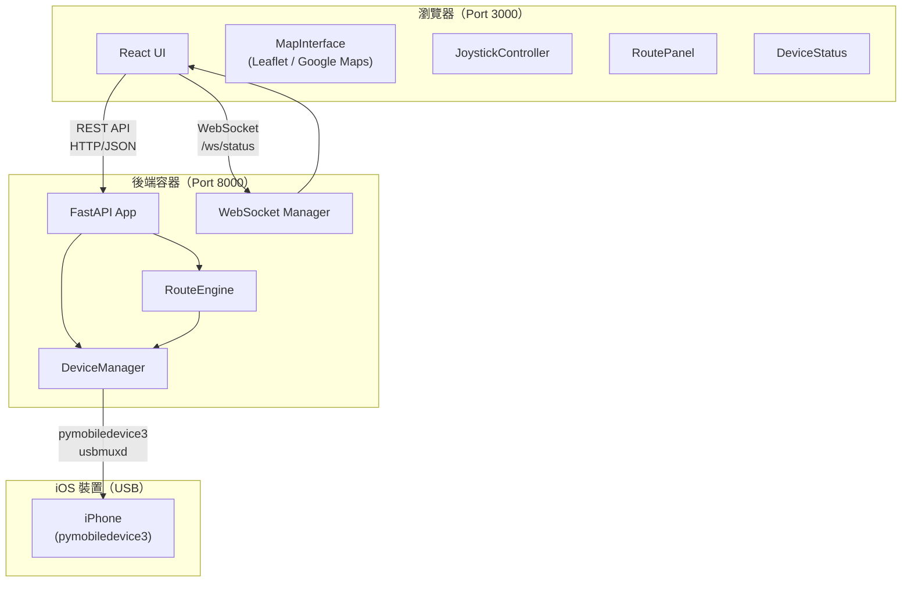
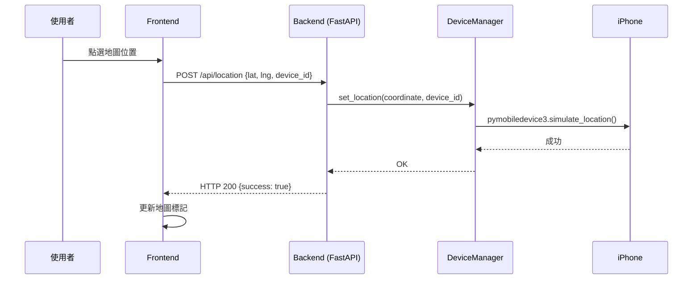
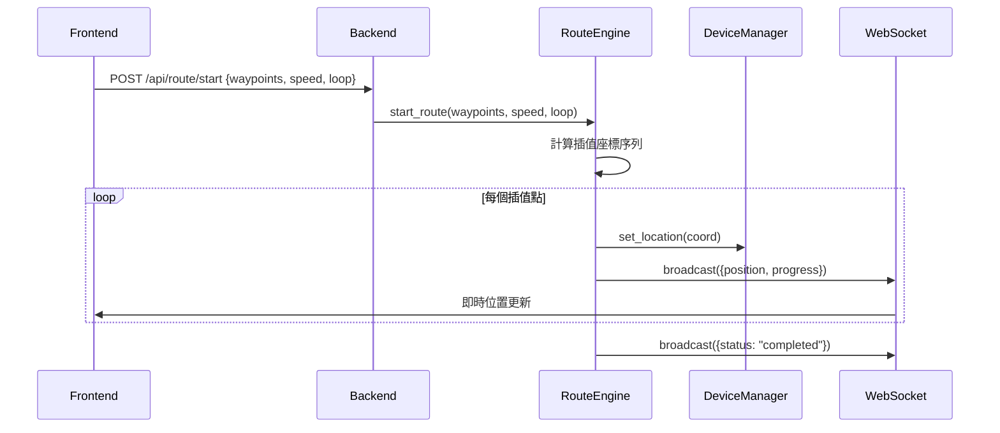

# 技術設計文件：iOS GPS 模擬器

## 概覽

iOS GPS 模擬器是一個全端網頁應用程式，讓使用者透過瀏覽器介面控制 iPhone 的模擬 GPS 位置。
系統由 React 前端與 FastAPI 後端組成，後端透過 pymobiledevice3 與 iOS 裝置通訊，整體以 Docker Compose 部署。

### 設計目標

- **低延遲**：地圖點選到 GPS 更新的端對端延遲 < 500ms
- **可靠性**：裝置斷線時優雅降級，不崩潰
- **可測試性**：後端支援 mock mode，無需實體裝置即可開發與測試
- **可擴展性**：地圖提供者可透過環境變數切換（Leaflet / Google Maps）

---

## 架構

### 系統架構圖



### 資料流



### 路徑自動移動流程



---

## 元件與介面

### 後端元件

#### FastAPI App（`main.py`）

應用程式入口，負責：
- 掛載所有 Router（`/api/devices`、`/api/location`、`/api/route`、`/api/status`）
- 初始化 `DeviceManager` 與 `RouteEngine` 單例
- 啟動 WebSocket 端點 `/ws/status`
- 設定 CORS（允許前端 origin）

#### DeviceManager（`services/device_manager.py`）

封裝所有 pymobiledevice3 操作，對外提供統一介面。

```python
class DeviceManager:
    def __init__(self, mock_mode: bool = False): ...

    async def list_devices(self) -> list[DeviceInfo]: ...
    # 回傳目前透過 USB 連線的裝置清單

    async def set_location(
        self,
        device_id: str,
        coordinate: GPSCoordinate
    ) -> None: ...
    # 設定指定裝置的模擬 GPS 位置
    # 若 device_id 不存在，拋出 DeviceNotFoundError
    # 若 pymobiledevice3 失敗，拋出 LocationSetError

    async def stop_simulation(self, device_id: str) -> None: ...
    # 停止指定裝置的 GPS 模擬，恢復真實位置

    def get_device(self, device_id: str) -> DeviceInfo | None: ...
    # 取得單一裝置資訊，不存在回傳 None

    async def start_device_polling(self) -> None: ...
    # 背景任務：每 5 秒掃描一次 USB 裝置，更新內部裝置清單
```

**Mock Mode 行為**：當 `MOCK_MODE=true` 或 USB 不可用時，`set_location` 僅記錄 log，不實際呼叫 pymobiledevice3。`list_devices` 回傳一個假裝置 `{"id": "mock-device-001", "name": "Mock iPhone"}`。

#### RouteEngine（`services/route_engine.py`）

負責路徑插值計算與自動移動執行。

```python
class RouteEngine:
    def __init__(self, device_manager: DeviceManager): ...

    async def start_route(
        self,
        device_id: str,
        waypoints: list[GPSCoordinate],
        speed: float,  # m/s
        loop: bool = False,
        on_position_update: Callable[[GPSCoordinate, float], Awaitable[None]] | None = None
    ) -> None: ...
    # 啟動路徑自動移動（asyncio Task）
    # on_position_update(coord, progress_ratio) 為位置更新回呼

    async def pause_route(self) -> None: ...
    async def resume_route(self) -> None: ...
    async def stop_route(self) -> None: ...

    def get_status(self) -> RouteStatus: ...
    # 回傳 RouteStatus(state, current_position, progress)

    @staticmethod
    def interpolate_route(
        waypoints: list[GPSCoordinate],
        speed: float,
        update_interval: float = 1.0  # 秒
    ) -> list[tuple[GPSCoordinate, float]]: ...
    # 回傳 [(座標, 距上一點的等待秒數), ...]
    # 使用 Haversine 公式計算兩點距離
```

#### WebSocket Manager（`services/ws_manager.py`）

```python
class WebSocketManager:
    async def connect(self, websocket: WebSocket) -> None: ...
    async def disconnect(self, websocket: WebSocket) -> None: ...
    async def broadcast(self, message: dict) -> None: ...
    # 廣播給所有已連線的 WebSocket 客戶端
```

### 前端元件

#### MapInterface（`components/MapInterface.tsx`）

- 根據 `VITE_GOOGLE_MAPS_API_KEY` 環境變數決定使用 Leaflet 或 Google Maps
- 管理地圖標記（目前位置、路徑點、路徑線）
- 點選事件回呼：`onMapClick(coord: GPSCoordinate)`
- Props：`mode: 'single' | 'route'`（單點模式 / 路徑規劃模式）

#### JoystickController（`components/JoystickController.tsx`）

- 使用 `nipplejs` 或自製 Canvas 搖桿
- 每 200ms throttle 發送座標更新
- Props：`speed: number`（m/s）、`onMove(vector: MoveVector)`、`onRelease()`

#### RoutePanel（`components/RoutePanel.tsx`）

- 顯示已選路徑點清單
- 速度選擇器（步行 / 跑步 / 騎車 / 自訂）
- 啟動 / 暫停 / 繼續 / 停止按鈕
- 循環模式開關

#### DeviceStatus（`components/DeviceStatus.tsx`）

- 顯示已連線裝置清單
- 裝置選擇下拉選單
- 連線狀態指示燈（綠色 / 紅色）

### API 客戶端（`api/client.ts`）

```typescript
export const apiClient = {
  getDevices(): Promise<DeviceInfo[]>
  setLocation(req: SetLocationRequest): Promise<void>
  startRoute(req: RouteRequest): Promise<void>
  pauseRoute(): Promise<void>
  stopRoute(): Promise<void>
  getStatus(): Promise<SimulationStatus>
}

export function createStatusWebSocket(
  onMessage: (status: StatusUpdate) => void
): WebSocket
```

### 自訂 Hooks

#### `useDevice`（`hooks/useDevice.ts`）

```typescript
function useDevice(): {
  devices: DeviceInfo[]
  selectedDevice: DeviceInfo | null
  selectDevice(id: string): void
  isLoading: boolean
  error: string | null
}
```

#### `useRoute`（`hooks/useRoute.ts`）

```typescript
function useRoute(): {
  waypoints: GPSCoordinate[]
  addWaypoint(coord: GPSCoordinate): void
  removeWaypoint(index: number): void
  clearWaypoints(): void
  routeStatus: RouteStatus
  startRoute(speed: number, loop: boolean): Promise<void>
  pauseRoute(): Promise<void>
  stopRoute(): Promise<void>
}
```

---

## 資料模型

### 後端 Pydantic 模型（`models/schemas.py`）

```python
from pydantic import BaseModel, Field, field_validator
from enum import Enum

class GPSCoordinate(BaseModel):
    latitude: float = Field(..., ge=-90, le=90)
    longitude: float = Field(..., ge=-180, le=180)

class DeviceInfo(BaseModel):
    id: str
    name: str
    is_connected: bool
    model: str | None = None

class SetLocationRequest(BaseModel):
    latitude: float = Field(..., ge=-90, le=90)
    longitude: float = Field(..., ge=-180, le=180)
    device_id: str

class RouteRequest(BaseModel):
    device_id: str
    waypoints: list[GPSCoordinate] = Field(..., min_length=2)
    speed: float = Field(..., ge=1.0, le=10.0)  # m/s
    loop: bool = False

class SimulationState(str, Enum):
    IDLE = "idle"
    MOVING = "moving"
    PAUSED = "paused"

class RouteStatus(BaseModel):
    state: SimulationState
    current_position: GPSCoordinate | None = None
    progress: float = 0.0  # 0.0 ~ 1.0
    device_id: str | None = None

class StatusUpdate(BaseModel):
    """WebSocket 推送訊息"""
    type: str  # "position" | "status" | "device"
    data: dict

class ErrorResponse(BaseModel):
    error: str
    code: str  # "DEVICE_NOT_FOUND" | "LOCATION_SET_FAILED" | "INVALID_COORDINATE" 等
```

### 前端 TypeScript 型別（`types/index.ts`）

```typescript
export interface GPSCoordinate {
  latitude: number
  longitude: number
}

export interface DeviceInfo {
  id: string
  name: string
  isConnected: boolean
  model?: string
}

export interface SetLocationRequest {
  latitude: number
  longitude: number
  deviceId: string
}

export interface RouteRequest {
  deviceId: string
  waypoints: GPSCoordinate[]
  speed: number
  loop: boolean
}

export type SimulationState = 'idle' | 'moving' | 'paused'

export interface RouteStatus {
  state: SimulationState
  currentPosition: GPSCoordinate | null
  progress: number  // 0.0 ~ 1.0
}

export interface MoveVector {
  angle: number    // 方位角，0 = 正北，順時針，單位：度
  magnitude: number  // 0.0 ~ 1.0，搖桿偏移比例
}
```

---

## 正確性屬性

*屬性（Property）是指在系統所有有效執行中都應成立的特性或行為——本質上是對系統應做什麼的形式化陳述。屬性作為人類可讀規格與機器可驗證正確性保證之間的橋樑。*

本節列出適合以屬性測試（Property-Based Testing）驗證的核心邏輯。經過 prework 分析，本系統中有三個核心計算邏輯適合 PBT：路徑時間間隔計算、搖桿移動向量計算、GPS 座標驗證。

**屬性反思（Property Reflection）**：

- 屬性 1（路徑時間間隔）與屬性 2（Haversine 距離）密切相關，但各自驗證不同層面：前者驗證時間計算的正確性，後者驗證距離計算的精度。兩者不重複，保留。
- 屬性 3（搖桿向量）與屬性 1/2 無重疊，保留。
- 屬性 4（座標驗證）測試邊界條件，與其他屬性無重疊，保留。

---

### 屬性 1：路徑移動時間間隔計算正確性

*對於任意* 兩個有效 GPS 座標點與任意有效速度（1.0 ~ 10.0 m/s），`RouteEngine.interpolate_route` 計算出的移動時間間隔應等於兩點間的 Haversine 距離除以速度（誤差 < 0.001 秒）。

**驗證：需求 3.3**

---

### 屬性 2：Haversine 距離計算精度

*對於任意* 兩個有效 GPS 座標點，`haversine_distance` 函式計算出的距離應滿足：
1. 非負值（距離 ≥ 0）
2. 對稱性：`distance(A, B) == distance(B, A)`
3. 同點距離為零：`distance(A, A) == 0`

**驗證：需求 3.3、3.4**

---

### 屬性 3：搖桿移動向量計算正確性

*對於任意* 方位角（0 ~ 360 度）與任意速度（1.0 ~ 10.0 m/s）及時間間隔（0.2 秒），`calculate_gps_offset` 函式計算出的 GPS 偏移量應滿足：
1. 偏移距離（以 Haversine 計算）≈ 速度 × 時間間隔（誤差 < 1m）
2. 偏移方向與輸入方位角一致（誤差 < 1 度）

**驗證：需求 4.2**

---

### 屬性 4：GPS 座標驗證邊界正確性

*對於任意* 緯度超出 [-90, 90] 或經度超出 [-180, 180] 的座標，後端 API 應回傳 HTTP 422；*對於任意* 在有效範圍內的座標，API 應接受請求（不回傳 422）。

**驗證：需求 5.7**

---

## 低階設計

### Haversine 距離公式

計算地球表面兩點間的大圓距離：

```python
import math

EARTH_RADIUS_M = 6_371_000  # 地球半徑（公尺）

def haversine_distance(
    coord1: GPSCoordinate,
    coord2: GPSCoordinate
) -> float:
    """
    計算兩個 GPS 座標之間的距離（公尺）。
    使用 Haversine 公式，適用於短距離（< 數百公里）。
    """
    lat1 = math.radians(coord1.latitude)
    lat2 = math.radians(coord2.latitude)
    dlat = math.radians(coord2.latitude - coord1.latitude)
    dlng = math.radians(coord2.longitude - coord1.longitude)

    a = (math.sin(dlat / 2) ** 2
         + math.cos(lat1) * math.cos(lat2) * math.sin(dlng / 2) ** 2)
    c = 2 * math.atan2(math.sqrt(a), math.sqrt(1 - a))

    return EARTH_RADIUS_M * c
```

### 路徑插值演算法

`RouteEngine.interpolate_route` 將路徑點序列展開為等時間間隔的座標序列：

```python
def interpolate_route(
    waypoints: list[GPSCoordinate],
    speed: float,          # m/s
    update_interval: float = 1.0  # 秒，每次更新的時間間隔
) -> list[tuple[GPSCoordinate, float]]:
    """
    將路徑點序列插值為細粒度座標序列。

    演算法：
    1. 對每對相鄰路徑點，計算 Haversine 距離
    2. 計算該段所需時間 = 距離 / 速度
    3. 計算插值步數 = ceil(時間 / update_interval)
    4. 線性插值緯度與經度（短距離下線性插值誤差可忽略）
    5. 每個插值點的等待時間 = 段時間 / 步數

    回傳：[(座標, 等待秒數), ...]
    """
    result = []
    for i in range(len(waypoints) - 1):
        p1, p2 = waypoints[i], waypoints[i + 1]
        distance = haversine_distance(p1, p2)
        segment_time = distance / speed  # 秒
        steps = max(1, math.ceil(segment_time / update_interval))
        wait_per_step = segment_time / steps

        for step in range(steps):
            t = step / steps  # 0.0 ~ 1.0（不含終點，避免重複）
            coord = GPSCoordinate(
                latitude=p1.latitude + t * (p2.latitude - p1.latitude),
                longitude=p1.longitude + t * (p2.longitude - p1.longitude)
            )
            result.append((coord, wait_per_step))

    # 加入最後一個路徑點
    result.append((waypoints[-1], 0.0))
    return result
```

**設計決策**：使用線性插值而非球面插值（slerp），因為 GPS 模擬的移動距離通常在數公里以內，線性插值的誤差遠小於 1 公尺，且計算成本更低。

### 搖桿 GPS 偏移計算

```python
def calculate_gps_offset(
    current: GPSCoordinate,
    bearing_degrees: float,  # 方位角，0 = 正北，順時針
    speed: float,            # m/s
    elapsed_seconds: float   # 時間間隔（秒）
) -> GPSCoordinate:
    """
    根據方位角與速度計算新的 GPS 座標。

    演算法：
    1. 計算移動距離 = speed * elapsed_seconds
    2. 將方位角轉換為弧度
    3. 使用球面三角學計算新座標
    """
    distance = speed * elapsed_seconds
    bearing = math.radians(bearing_degrees)

    lat1 = math.radians(current.latitude)
    lng1 = math.radians(current.longitude)

    angular_distance = distance / EARTH_RADIUS_M

    lat2 = math.asin(
        math.sin(lat1) * math.cos(angular_distance)
        + math.cos(lat1) * math.sin(angular_distance) * math.cos(bearing)
    )
    lng2 = lng1 + math.atan2(
        math.sin(bearing) * math.sin(angular_distance) * math.cos(lat1),
        math.cos(angular_distance) - math.sin(lat1) * math.sin(lat2)
    )

    return GPSCoordinate(
        latitude=math.degrees(lat2),
        longitude=math.degrees(lng2)
    )
```

### 裝置輪詢機制

`DeviceManager.start_device_polling` 以 asyncio 背景任務每 5 秒掃描一次 USB 裝置：

```python
async def start_device_polling(self) -> None:
    while True:
        try:
            if not self.mock_mode:
                # 呼叫 pymobiledevice3 掃描裝置
                connected = await self._scan_usb_devices()
                self._update_device_registry(connected)
        except Exception as e:
            logger.warning(f"裝置掃描失敗: {e}")
        await asyncio.sleep(5)

def _update_device_registry(
    self,
    connected_ids: list[str]
) -> None:
    """
    比對新舊裝置清單：
    - 新增裝置：加入 registry，觸發 on_device_connected 事件
    - 消失裝置：標記為斷線，停止其 GPS 模擬，觸發 on_device_disconnected 事件
    """
    ...
```

### RouteEngine 狀態機

```
         start_route()
IDLE ─────────────────► MOVING
 ▲                         │
 │    stop_route()          │ pause_route()
 │◄──────────────────────── │
 │                         ▼
 │    stop_route()       PAUSED
 └──────────────────────────┘
                  resume_route()
              PAUSED ──────────► MOVING
```

狀態轉換規則：
- `IDLE → MOVING`：`start_route()` 且 waypoints ≥ 2
- `MOVING → PAUSED`：`pause_route()`
- `PAUSED → MOVING`：`resume_route()`
- `MOVING/PAUSED → IDLE`：`stop_route()`
- 裝置斷線：任何狀態 → `IDLE`（並廣播錯誤）

---

## 錯誤處理

### 後端錯誤碼

| HTTP 狀態碼 | 錯誤碼 | 觸發條件 |
|------------|--------|---------|
| 400 | `LOCATION_SET_FAILED` | pymobiledevice3 設定位置失敗 |
| 404 | `DEVICE_NOT_FOUND` | 指定的 device_id 不存在 |
| 409 | `ROUTE_ALREADY_RUNNING` | 嘗試啟動路徑時已有路徑在執行 |
| 422 | `INVALID_COORDINATE` | GPS 座標超出有效範圍 |
| 422 | `INVALID_ROUTE` | 路徑點少於 2 個 |
| 503 | `DEVICE_UNAVAILABLE` | 裝置暫時無法使用 |

### 前端錯誤處理策略

- API 呼叫失敗：顯示 toast 通知，不中斷使用者操作
- WebSocket 斷線：自動重連（指數退避，最多 5 次），重連期間顯示「連線中...」狀態
- 裝置斷線：停止所有控制操作，顯示警告橫幅，保留路徑點資料

### Mock Mode 降級

當 `MOCK_MODE=true` 或 USB 不可用時：
- `DeviceManager` 記錄 `WARNING: USB 裝置不可用，以 mock mode 啟動`
- 所有 `set_location` 呼叫記錄 log 但不實際傳送
- `list_devices` 回傳固定的假裝置清單
- 前端功能完整可用，適合開發與測試

---

## 測試策略

### 測試分層

**單元測試（pytest / Vitest）**

後端：
- `test_haversine_distance`：驗證距離計算的對稱性、非負性、同點為零
- `test_interpolate_route`：驗證插值點數量、時間間隔計算
- `test_calculate_gps_offset`：驗證偏移方向與距離
- `test_device_manager_mock`：驗證 mock mode 行為
- `test_route_engine_state_machine`：驗證狀態轉換邏輯

前端：
- `MapInterface`：點選事件、標記更新
- `JoystickController`：向量計算、throttle 行為
- `RoutePanel`：速度選擇、按鈕狀態

**屬性測試（Hypothesis / fast-check）**

後端使用 [Hypothesis](https://hypothesis.readthedocs.io/)（Python PBT 函式庫）：

```python
# 屬性 1：路徑時間間隔計算
# Feature: ios-gps-simulator, Property 1: 路徑移動時間間隔計算正確性
@given(
    lat1=st.floats(-89, 89), lng1=st.floats(-179, 179),
    lat2=st.floats(-89, 89), lng2=st.floats(-179, 179),
    speed=st.floats(1.0, 10.0)
)
@settings(max_examples=100)
def test_route_time_interval_correctness(lat1, lng1, lat2, lng2, speed):
    p1 = GPSCoordinate(latitude=lat1, longitude=lng1)
    p2 = GPSCoordinate(latitude=lat2, longitude=lng2)
    result = interpolate_route([p1, p2], speed)
    total_time = sum(wait for _, wait in result)
    expected_time = haversine_distance(p1, p2) / speed
    assert abs(total_time - expected_time) < 0.001

# 屬性 2：Haversine 距離屬性
# Feature: ios-gps-simulator, Property 2: Haversine 距離計算精度
@given(
    lat1=st.floats(-89, 89), lng1=st.floats(-179, 179),
    lat2=st.floats(-89, 89), lng2=st.floats(-179, 179),
)
@settings(max_examples=100)
def test_haversine_properties(lat1, lng1, lat2, lng2):
    p1 = GPSCoordinate(latitude=lat1, longitude=lng1)
    p2 = GPSCoordinate(latitude=lat2, longitude=lng2)
    assert haversine_distance(p1, p2) >= 0                          # 非負
    assert haversine_distance(p1, p2) == haversine_distance(p2, p1) # 對稱
    assert haversine_distance(p1, p1) == 0                          # 同點為零

# 屬性 3：搖桿向量計算
# Feature: ios-gps-simulator, Property 3: 搖桿移動向量計算正確性
@given(
    lat=st.floats(-89, 89), lng=st.floats(-179, 179),
    bearing=st.floats(0, 360),
    speed=st.floats(1.0, 10.0)
)
@settings(max_examples=100)
def test_gps_offset_correctness(lat, lng, bearing, speed):
    current = GPSCoordinate(latitude=lat, longitude=lng)
    elapsed = 0.2  # 200ms
    new_coord = calculate_gps_offset(current, bearing, speed, elapsed)
    actual_distance = haversine_distance(current, new_coord)
    expected_distance = speed * elapsed
    assert abs(actual_distance - expected_distance) < 1.0  # 誤差 < 1m

# 屬性 4：GPS 座標驗證
# Feature: ios-gps-simulator, Property 4: GPS 座標驗證邊界正確性
@given(
    lat=st.floats(-200, 200),
    lng=st.floats(-300, 300)
)
@settings(max_examples=100)
def test_coordinate_validation(lat, lng):
    is_valid = -90 <= lat <= 90 and -180 <= lng <= 180
    coord = {"latitude": lat, "longitude": lng, "device_id": "test"}
    response = client.post("/api/location", json=coord)
    if is_valid:
        assert response.status_code != 422
    else:
        assert response.status_code == 422
```

前端使用 [fast-check](https://fast-check.io/)（TypeScript PBT 函式庫）：

```typescript
// Feature: ios-gps-simulator, Property 3: 搖桿移動向量計算正確性
test('搖桿偏移距離符合速度×時間', () => {
  fc.assert(fc.property(
    fc.float({ min: 0, max: 360 }),  // bearing
    fc.float({ min: 1, max: 10 }),   // speed
    (bearing, speed) => {
      const current = { latitude: 25.0, longitude: 121.5 }
      const result = calculateGpsOffset(current, bearing, speed, 0.2)
      const dist = haversineDistance(current, result)
      return Math.abs(dist - speed * 0.2) < 1.0
    }
  ), { numRuns: 100 })
})
```

**整合測試**

- 使用 mock mode 驗證前後端 API 串接
- 驗證 WebSocket 狀態推送
- 驗證 Docker Compose 服務啟動

**Smoke 測試**

- 驗證 `docker-compose.yml` 格式正確
- 驗證 Backend 容器 USB 掛載設定
- 驗證 Frontend / Backend 連接埠設定
